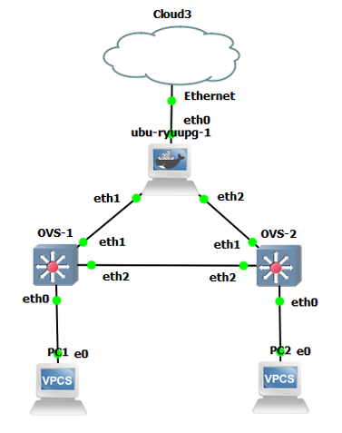

# MTD algorithm for random IP addres mutation
Author: Mateusz Jędrzejewski-Szpak

### 1. What is MTD
  Implementing a moving target defence variation can partially offset the asymmetry between attackers and defenders, introducing unpredictability into the attack surface. MTD is thus a set of techniques that enhance proactivity and add elements that enable the permanent reconfiguration of systems and networks, thereby changing their static nature.

### 2. About the algorithm
  The algorithm is part of the engineering thesis "Implementation of an environment for the simulation of network solutions based on the Moving Target Defense architecture." It was tested in a virtual environment using the GNS3 simulator (https://gns3.com). The algorithm is written in Python using the SDN framework Ryu (https://ryu-sdn.org).
  
The test topology is shown in the image below:
  
  

  ubu-ryuupg-1 is a Ubuntu Docker container (https://hub.docker.com/r/gns3/ubuntu) with Python version () and the RYU framework installed;
  
OVS-1 and OVS-2 are docker contsiner with preinstaled Open vSwitch software (https://hub.docker.com/r/gns3/openvswitch), more about OVS here (https://www.openvswitch.org);

PC1 and PC2 are virtual PC's that come with GNS3;

Cloud3 (optional) is internet access in case additional packages need to be installed, more about accessing the internet via GNS3 here (https://docs.gns3.com/docs/using-gns3/advanced/connect-gns3-internet/)

#### 2.1 What dose the algorithm do?
  The algorithm implements the idea of moving target defence in the network category, using the concept of virtual IP addresses. According to this concept, each host has two IP addresses - a real address (rIP) and a virtual address (vIP). The rIP is permanently assigned to the host and is only visible to it. The vIP is a short-lived IP address assigned to each host by the SDN controller, in this case, the RYU. Network communication takes place using the vIP.
  
To make this possible, an algorithm manages the allocation of vIPs to hosts on the network. It also installs flows in the virtual switches (OVS) that allow communication by converting rIP into vIP. In the algorithm, the resource pool for virtual addresses and the frequency of vIP change can be configured. It is important to note that only hosts with rIPs defined in the algorithm will be able to receive virtual addresses, which is a prerequisite for network communication. 

#### 2.2 Instalation of RYU

For the RYU framework to work correctly, it is necessary to install an older version of Python (in this case, version 3.8.19 was chosen). For the RYU framework to work correctly, it is necessary to install an older version of Python (in this case, version 3.8.19 was chosen). The installation of RYU itself is straightforward and requires a single command:
```
pip instal ryu
```

It is possible to install Ryu from the source code:
```
git clone git://github.com/osrg/ryu.git
cd ryu; python ./setup.py install
```
However, to avoid errors and library conflicts, the requirements.txt file shows the libraries and their version for which the framework worked correctly. If errors still occur, it is worth checking (https://github.com/faucetsdn/ryu/issues). 

To run the controller with the selected script, simply use the following command:
```
ryu-manager <your_script_here.py>
```

### 3. Influence the MTD algorithm on security and network performance

In testing the algorithm, it was found that:

On security issues:

Adding the algorithm to the network without any additional security measures, per se, prevented hosts from scanning from the external network. In the event of a host being compromised inside the network, it is possible to detect other hosts, but thanks to the vIP, only virtual IP addresses are visible. As a result, information gained during reconnaissance quickly becomes outdated.

On network performance issues:

The addition of the algorithm to the network meant that when virtual IP addresses were reassigned to hosts, there were significant drops in network throughput and dropped connections. Other than these moments, there was no negative impact on network performance.
